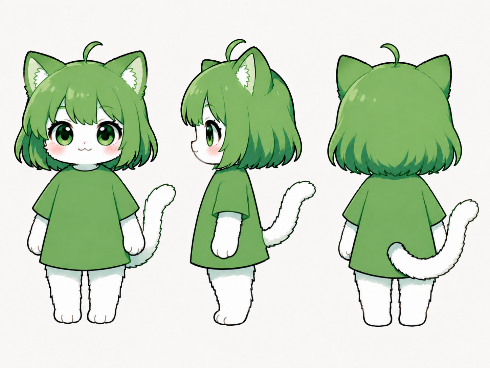
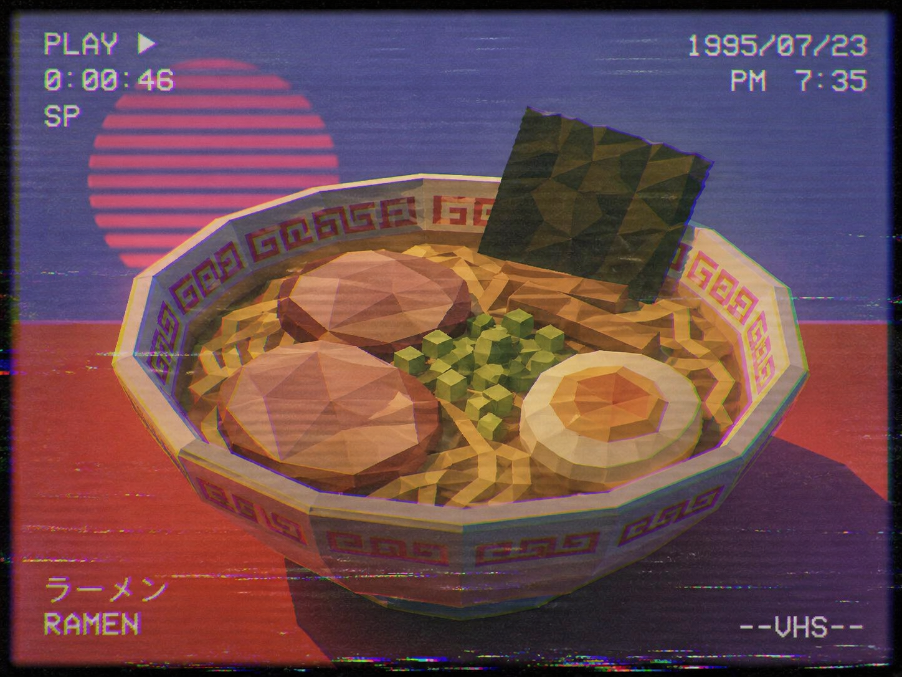

# ComfyUI-MiniMax-H3-Workflows-For3060

RTX 3060 12GB環境でMiniMax-H3をローカル実行するための、T2V（Text to Video）／I2V（Image to Video）／R2V（Reference to Video）／R2I（Reference to Image）用ComfyUIワークフローです。

## 収録ワークフロー

- `MiniMax-H3_T2V.json` — Text to Video
- `MiniMax-H3_I2V.json` — Image to Video
- `MiniMax-H3_T2V_TAE-Preview.json` — T2V＋TAEライブプレビュー
- `MiniMax-H3_I2V_TAE-Preview.json` — I2V＋TAEライブプレビュー
- `MiniMax-H3_T2V_TAE-Preview_Turbo.json` — T2V＋Turbo LoRA＋TAEライブプレビュー
- `MiniMax-H3_I2V_TAE-Preview_Turbo.json` — I2V＋Turbo LoRA＋TAEライブプレビュー
- `MiniMax-H3_R2V_PDD_Acc.json` — 2枚の参照画像を使用するR2V＋Alibaba PAI PDD Acc＋TAEライブプレビュー
- `MiniMax-H3_R2V_Turbo_2images/` — 2枚の参照画像を使用するR2V Turbo
- `MiniMax-H3_R2V_Turbo_Lip-sync/` — 参照画像と音声を使用するR2V Turboリップシンク
- `MiniMax-H3_R2I/` — 2枚の参照画像から1枚の静止画を生成するR2I（通常版／Turbo LoRA版）

## ハードウェア・実行環境

- **GPU:** NVIDIA GeForce RTX 3060 12GB
- **RAM:** 64GB
- **GPUドライバー:** 591.86
- **ComfyUI:** 0.30.0（commit `a464ac33`、[PR #15334](https://github.com/Comfy-Org/ComfyUI/pull/15334) のMiniMax-H3 int8 ConvRot Video VAE対応を含むビルド）
- **Python:** 3.10.10
- **PyTorch:** 2.11.0+cu130
- **CUDA Runtime:** 13.0
- **cuDNN:** 9.19
- **SageAttention:** 2.2.0
- **Triton Windows:** 3.7.1.post27

## 使用モデル

### T2V／I2V用MiniMax-H3本体

`minimax_h3_fl2va_pruned_int8_convrot.safetensors`  
約20.97GB

### R2V用MiniMax-H3本体

`minimax_h3_ref2va_pruned_int8_convrot.safetensors`  
約20.97GB

配布元：  
[Comfy-Org/MiniMax-H3](https://huggingface.co/Comfy-Org/MiniMax-H3/blob/main/diffusion_models/minimax_h3_ref2va_pruned_int8_convrot.safetensors)

配置先：

```text
ComfyUI/models/diffusion_models/minimax_h3_ref2va_pruned_int8_convrot.safetensors
```

### テキストエンコーダー

`qwen3vl_32b_minimax_h3_nvfp4_awq.safetensors`  
約15.69GB

### Video VAE

`minimax_h3_video_vae_int8_convrot.safetensors`

この量子化Video VAEを使用するには、[ComfyUI PR #15334](https://github.com/Comfy-Org/ComfyUI/pull/15334) の変更を含むComfyUIが必要です。

配布元：  
[MiniMax-H3 experimental — int8 ConvRot Video VAE](https://huggingface.co/Kijai/MiniMax-H3-experimental/blob/main/minimax_h3_video_vae_int8_convrot.safetensors)

配置先：

```text
ComfyUI/models/vae/minimax_h3_video_vae_int8_convrot.safetensors
```

### Audio VAE

`minimax_h3_audio_vae_fp32.safetensors`  
約0.61GB

モデル群はRTX 3060の12GB VRAMには収まらないため、ComfyUIのDynamic VRAMとCPUオフロードを使用します。

## Turbo LoRA版

Turbo版では、Turbo LoRAを適用したT2V／I2V／R2Vワークフローを収録しています。

- **LoRA:** `minimax_h3_turbo_4step_ema_ckpt850_pruned_comfyui.safetensors`
- **配置先:** `ComfyUI/models/loras/`
- **LoRA strength:** 1.0
- **Sampling steps:** 8
- **Sampler:** `res_multistep`
- **Scheduler:** `simple`
- **Video／Audio sigma shift:** 12／5
- **EasyCache:** 無効

**導入したLoRA:** [MiniMax-H3-Turbo-Lora-ComfyUI](https://huggingface.co/drbaph/MiniMax-H3-Turbo-Lora-ComfyUI) (MiniMax-H3本体がprunedのためこちらを使用)

**関連プロジェクト:** [ComfyUI-MiniMax-H3-Turbo](https://github.com/Larryvrh/ComfyUI-MiniMax-H3-Turbo)

## R2V PDD Acc版

[`MiniMax-H3_R2V_PDD_Acc.json`](MiniMax-H3_R2V_PDD_Acc.json)は、Alibaba PAIが公開したMiniMax-H3 Ref2VA用PDD Accを使用し、2枚の参照画像から動画と音声を8 NFEで生成するWorkflowです。TAEライブプレビュー、解像度プリセット、秒数からフレーム数への自動変換、生成音声のON／OFF切り替えを備えています。

PDD Accファイルは通常のLoRAだけでなく、ステップごとのPDD head bankを含みます。そのため、通常の`Load LoRA`ノードではなく、専用カスタムノードの`MiniMaxH3PDDAccApply`を使用します。

- **LoRA配布元:** [alibaba-pai/MiniMax-H3-Acc-LoRAs](https://huggingface.co/alibaba-pai/MiniMax-H3-Acc-LoRAs)
- **カスタムノード:** [Jalen-Brunson/ComfyUI-MiniMax-H3-PDD-Acc](https://github.com/Jalen-Brunson/ComfyUI-MiniMax-H3-PDD-Acc)
- **使用ファイル:** `MiniMax-H3-Ref2VA-Acc-8Step.safetensors`
- **配置先:** `ComfyUI/models/pdd_acc/`
- **MiniMax-H3本体:** `minimax_h3_ref2va_pruned_int8_convrot.safetensors`
- **NFE:** 8
- **Sampler:** `euler`
- **Sigmas:** `MiniMaxH3PDDAccApply`ノードの`sigmas`出力
- **Guidance:** `BasicGuider`（CFG-free）
- **Video／Audio sigma shift:** 12／3
- **LoRA／PDD head strength:** 1.0／1.0
- **画面比率・解像度:** 16:9、0.4MP、32の倍数
- **生成時間:** 初期値5秒（24fpsの有効フレーム数へ自動変換、5秒時は124フレーム）
- **TAEライブプレビュー:** 有効、Workflow内でON／OFF切り替え可能
- **生成音声:** 有効、Workflow内でON／OFF切り替え可能

カスタムノードの導入例：

```bash
cd ComfyUI/custom_nodes
git clone https://github.com/Jalen-Brunson/ComfyUI-MiniMax-H3-PDD-Acc.git
```

PDD Accは学習済みの専用sigma境界を使用するため、Turbo LoRA、EasyCache、BlockCache、Spectrum、`res_multistep`などのマルチステップサンプラーとは併用しないでください。TAEプレビューには、後述するComfyUI-KJNodesと`taeh3.safetensors`も必要です。

## R2V Turbo版

R2V Turbo版は、Workflow JSON、オリジナルの入力素材、生成結果をフォルダ単位で収録しています。いずれも公式サンプルプロンプトではなく、Workflow内のオリジナルプロンプトを使用しています。

### MiniMax-H3_R2V_Turbo_2images

2枚の参照画像から、キャラクター、料理、ビジュアルスタイルを参照して動画を生成するWorkflowです。

- **参照画像:** 2枚
- **画面比率:** 16:9
- **解像度設定:** 0.4MP
- **生成時間:** 5秒
- **フレームレート:** 24fps
- **音声出力:** 有効
- **TAEライブプレビュー:** 有効

収録ファイル：

- [`MiniMax-H3_R2V_Turbo_2images.json`](MiniMax-H3_R2V_Turbo_2images/MiniMax-H3_R2V_Turbo_2images.json) — Workflow
- [`3menzu.png`](MiniMax-H3_R2V_Turbo_2images/3menzu.png) — 参照画像1
- [`lowpoly_ramen.png`](MiniMax-H3_R2V_Turbo_2images/lowpoly_ramen.png) — 参照画像2
- [`MiniMax-H3_R2V_Turbo_2images.mp4`](MiniMax-H3_R2V_Turbo_2images/MiniMax-H3_R2V_Turbo_2images.mp4) — 生成結果

<table>
<tr>
<td align="center"><strong>参照画像1</strong></td>
<td align="center"><strong>参照画像2</strong></td>
</tr>
<tr>
<td></td>
<td></td>
</tr>
</table>

[生成結果を表示](MiniMax-H3_R2V_Turbo_2images/MiniMax-H3_R2V_Turbo_2images.mp4)

### MiniMax-H3_R2V_Turbo_Lip-sync

参照画像のキャラクターに、入力音声と同期した口・表情・身体の動きを生成するWorkflowです。  
入力音声と一致したセリフをプロンプトに書くことで出力を安定させています。

- **参照画像:** 1枚
- **参照音声:** 1ファイル
- **画面比率:** 1:1
- **解像度設定:** 0.4MP
- **生成時間:** 13秒
- **フレームレート:** 24fps
- **音声出力:** 有効
- **TAEライブプレビュー:** 有効

収録ファイル：

- [`MiniMax-H3_R2V_Turbo_Lip-sync.json`](MiniMax-H3_R2V_Turbo_Lip-sync/MiniMax-H3_R2V_Turbo_Lip-sync.json) — Workflow
- [`Image.png`](MiniMax-H3_R2V_Turbo_Lip-sync/Image.png) — 参照画像
- [`Audio.wav`](MiniMax-H3_R2V_Turbo_Lip-sync/Audio.wav) — 参照音声
- [`MiniMax-H3_R2V_Turbo_Lip-sync.mp4`](MiniMax-H3_R2V_Turbo_Lip-sync/MiniMax-H3_R2V_Turbo_Lip-sync.mp4) — 生成結果


- [参照音声を再生](MiniMax-H3_R2V_Turbo_Lip-sync/Audio.wav)
- [生成結果を表示](MiniMax-H3_R2V_Turbo_Lip-sync/MiniMax-H3_R2V_Turbo_Lip-sync.mp4)

## 生成設定

- **Sampling steps:** 25
- **EasyCache reuse_threshold:** 0.3
- **EasyCache start_percent:** 0.2
- **EasyCache end_percent:** 0.9
- **EasyCache:** Turbo LoRA版（T2V／I2V／R2V）では無効
- **SageAttention:** 有効
- **Dynamic VRAM／CPUオフロード:** 有効
- **CUDAモジュール遅延ロード:** 有効
- **生成中プレビュー:** 通常版では無効

## TAEプレビュー版の追加要件

`TAE-Preview`付きワークフローでは、以下を追加で使用します。

- **カスタムノード:** ComfyUI-KJNodes（`ModelPreviewOverrideKJ`）
- **TAEモデル:** `taeh3.safetensors`
- **プレビュー設定:** 最大512px、JPEG品質80、12フレーム、12fps

TAEは生成中のプレビューにのみ使用し、最終動画のデコードには`minimax_h3_video_vae_int8_convrot.safetensors`を使用します。

## R2I（Reference to Image）版

`MiniMax-H3_R2I/`は、MiniMax-H3のRef2VA参照conditioningを使用し、動画ではなく静止画を1枚だけ生成するWorkflowです。[ComfyUI PR #15677](https://github.com/Comfy-Org/ComfyUI/pull/15677)で追加された通常の`Empty Latent Image`経路を使用し、1フレームだけサンプリングして単一画像用VAEでデコードします。

`MiniMax H3 Reference to Video`ノードはconditioning出力だけを使用し、同ノードが作る動画latentはサンプラーへ接続しません。プロンプト内の`<Picture 1>`、`<Picture 2>`は、入力した参照画像の順番に対応します。

### 追加要件

- **ComfyUI:** [PR #15677](https://github.com/Comfy-Org/ComfyUI/pull/15677)の変更を含むバージョン
- **単一画像用VAE:** [`minimax_h3_t1_image_vae_step1597.safetensors`](https://huggingface.co/Mamad8/MiniMax-H3-Image-VAE/blob/main/minimax_h3_t1_image_vae_step1597.safetensors)
- **VAE配置先:** `ComfyUI/models/vae/`

単一画像用VAEは、この静止画Workflowだけで使用してください。動画WorkflowのVideo VAEとは置き換えないでください。

`audio_vae`は`MiniMax H3 Reference to Video`ノードの必須入力なので接続しています。収録Workflowは参照画像だけを使用するため、音声のencode／decode処理は実行されません。

### 通常版の生成設定

- **MiniMax-H3本体:** `minimax_h3_ref2va_pruned_int8_convrot.safetensors`
- **Turbo LoRA:** 無効
- **Sampling steps:** 30
- **Sampler:** `res_multistep`
- **Scheduler:** `simple`
- **出力:** PNG 1枚
- **収録出力の解像度:** 2048x2048

### Turbo LoRA版の生成設定

`MiniMax-H3_R2I_Turbo.json`は、次のTurbo LoRAと生成設定を使用します。

- **LoRA:** [`minimax_h3_turbo_v4_step600_ema_pruned_comfyui.safetensors`](https://huggingface.co/drbaph/MiniMax-H3-Turbo-Lora-ComfyUI/blob/main/minimax_h3_turbo_v4_step600_ema_pruned_comfyui.safetensors)
- **配置先:** `ComfyUI/models/loras/`
- **LoRA strength:** 1.0
- **Sampling steps:** 8
- **Sampler:** `euler`
- **Scheduler:** `beta`
- **出力:** PNG 1枚

収録ファイル：

- [`MiniMax-H3_R2I.json`](MiniMax-H3_R2I/MiniMax-H3_R2I.json) — Workflow
- [`MiniMax-H3_R2I_Turbo.json`](MiniMax-H3_R2I/MiniMax-H3_R2I_Turbo.json) — Turbo LoRA版Workflow
- [`test_a.png`](MiniMax-H3_R2I/test_a.png) — 参照画像1
- [`test_b.png`](MiniMax-H3_R2I/test_b.png) — 参照画像2
- [`Output.png`](MiniMax-H3_R2I/Output.png) — 生成結果

<table>
<tr>
<td align="center"><strong>参照画像1</strong></td>
<td align="center"><strong>参照画像2</strong></td>
<td align="center"><strong>生成結果</strong></td>
</tr>
<tr>
<td></td>
<td></td>
<td></td>
</tr>
</table>
